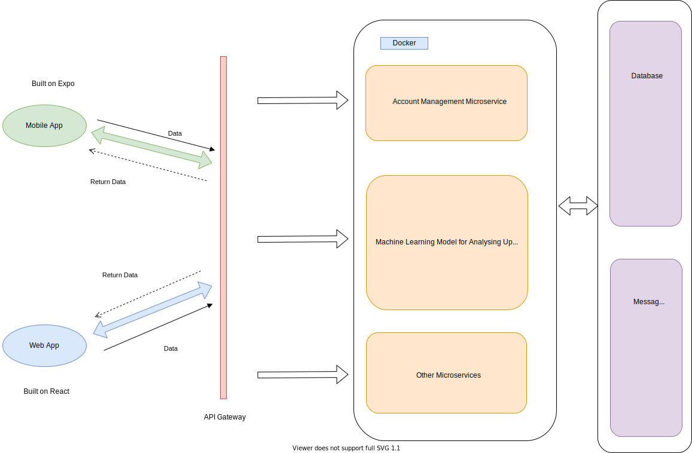

# SickKids Uroflowmetry
## Product Details

#### Q1: What are you planning to build?
Our product is an application that allows urology patients to do uroflowmetry at home and send test data remotely to clinicians. [Uroflowmetry](https://www.aboutkidshealth.ca/Article?contentid=1269&language=English) is a common practice in urology clinics to evaluate a patient's urine flow rate. The patient is asked to urinate into a device called a flow rate toilet that measures the volume and rate of urine flow. A uroflow curve is then generated based on the test result of the patient.

 This is an example of a uroflow curve: \
 

 Currently, uroflowmetry tests can only be done with a machine in clinics. Since the test is regularly conducted and relatively easy compared to other urodynamic tests, it is taking up time from nurses that could be better spent on other tasks. Imagine a busy day at an understaffed urology clinic, if urodynamics nurses had to do uroflowmetry for many of the patients, there would be less time for them to conduct more intellectually demanding tests such as [cystometrogram](https://www.aboutkidshealth.ca/Article?contentid=1291&language=English). From the patient's perspective, the test is not easily accessible since patients need to travel to the clinic to do the test. A young patient living outside Ontario would have trouble showing up to every followup uroflowmetry test at SickKids' clinic, which is located in Toronto.

 We are planning to build a web app and a mobile app to solve this problem. Through our product, patients would record the sound of urine through the mobile app, which is then directly sent to the web database where it is passed through a pre-developed natural network model and a uroflow curve is generated. The curve is then shared with predefined web users (clinicians) and is pushed back to mobile users (patients).

 This is a brief view of the prototype: \
 

#### Q2: Who are your target users?
 We've done this in an external site here: [Five Personas](https://hospitalforsickchildren.xtensio.com/55qfansq)

#### Q3: Why would your users choose your product? What are they using today to solve their problem/need?
 Our application can save users time. With our application, patients don't need to rush to the hospital to provide a urine sample. Instead, they only need to collect the sound of urine through the application. Doctors and nurses can obtain more frequent and accurate uroflowmetry samples which will improve their ability to diagnose, prognosticate, and treat their patients. Researchers can use the application for technical research to improve the ability of the algorithm to derive a uroflow curve from sound in many different environments and they can use the application for clinical research to evaluate how increasing the number and frequency of uroflowmetry changes clinical management and outcomes.

 Also, our application allows users to discover new information. The statistical analysis of urine data our application supports can help doctors make better plans of treatment. Collecting urine sound samples routinely makes patients actively participate in the treatment, which is beneficial to their mental health and can strengthen their willingness to recover from the disease, and it also enables patients to more frequently update their care provider with current and salient information about their condition.

 Regarding whether this application exists in another form, we would describe our product as a professional and task-oriented application used for the diagnosis and treatment for children suffering from urological conditions, whose usage is rather narrow. This is a novel technology and there is no similar product on the market. If we want to compare with products used in similar fields, i.e, laboratory test equipments, our application is designed to bring more convenience to patients and provide user-centered experience since children are a group that requires extra care.

 Last but not least, we can proudly say that our application aligns with our partner's organization's values. As we know, SickKids Hospital is fighting to save lives, to find new cures and to provide world-class care. Providing sick children with a better measurement of their urological condition through our application with greater convenience and efficiency, therefore aligning with the SickKids mandate.

#### Q4: How will you build it?
 We are planning to use JavaScript/TypeScript throughout the whole project. As there is an existing prototype on hand, we will just go ahead and use the same frameworks that prototype depends on, that is, [Expo][expo] for the mobile app frontend, [React][react] for the web app frontend that will be built from the ground up, [Feathers][feathers] for the backend API\authentication stuff and [PostgreSQL][postgres] for the database. [Docker][docker] will be introduced for both deployment and testing purposes to maintain a consistent and purely clean environment for the app to run smoothly such that "well the app does run on my computer, there's no reason it fails on the production server" kind of stories could be prevented. Both the production version of the backend and the web app will be hosted on our partner's server, and the mobile app will be pushed into the public preview channel of Google Play Store (for Android) and App Store (for iOS), though the beta version will be tested and hosted on our private servers for a much easier server management.

 Both the mobile app and the web app will exchange data with an API gateway using the [Feathers][feathers] framework that can redirect requests to specific API microservices that talk directly to the database. We may also deploy a message queue so that messages between microservices can be shared and pushed to predefined users.
 

 We are following a test-driven development model such that all tests will be pre-written before the actual implementation starts. For each commit and push to the remote repository we make, the testing server will automatically run through all unit tests and provide feedback. After releasing a version, the testing server will run through integration tests and UI tests to make sure all the apps will work as a complete system (manual tests will also be involved). The testing server might also be hosted on our own, running a [Jenkins][jenkins] instance.

#### Q5: What are the user stories that make up the MVP?
 1. As a new urology patient at SickKids, for the first time I log in I want to set a password so that I can take full control of my account.
      * Patients have to set their password for the first time they log on to the mobile app
      * If the password is not set then patients are not allowed to access the features
      * Passwords should be inputted twice to avoid any typos

 2. As a urology patient at SickKids, I want to login to this mobile app using the predefined username so that I can access the app.
      * Login patients only when given the correct username and password match
      * Patients can start using the mobile app only when they are logged in

 3. As a urology patient at SickKids, I want to record my urine sound in the app so that I can have a more productive visit at the clinic.
      * Having a record option for patients
      * Require a timestamp after saving the record
      * Imply patients the start of a recording process

 4. As a urology patient at SickKids, I want to cancel or delete my recordings so I do not upload a false recording to the system.
      * Patients can choose to delete their recordings before submitting them.
      * A ten-day recovery time will be given if patients accidentally delete a record
      * The recovery functionality is only applicable for those that record by this mobile app

 5. As a urology patient at SickKids, I want to upload my void sound through the app so that I can take my uroflowmetry tests remotely
      * Patients can upload void sound recording
      * Uploading can be done off-site if there is an Internet connection
      * Before uploading patients could have a second chance to review the sound
      * Patients can select to upload either one or more records
      * Patients can enter their urine condition, including "leak", "urgency" and "poop", during the upload

 6. As a urology patient at SickKids, I want to view my uroflow curve so that I can get to know my current health condition
      * Patients can select to view the generated curve from a uploaded recording

 7. As a urology patient at SickKids, I want to view all my past uroflow so that I can keep a record of my past test results.
      * Patients will be able to see all the records and feedbacks
      * Patients can select what to see within some years, some months, some weeks or some days
      * Patients can sort all the information based on time or urgent level

 8. As a new urology clinician in SickKids, for the first time I log in I want to set a password so that I can access the web app.
      * Clinicians have to set their password for the first time they log on to the mobile app
      * If the password is not set then clinicians are not allowed to access the features

 9. As a urology clinician at SickKids, I want to login to the web app using the predefined username so that I can access my patient's test results.
      * Login clinicians only when given the correct username and password match
      * Clinicians can start using the web app only when they are logged in

 10. As a urology clinician in SickKids, I want to view a patient's test results in my clinic so that I can prognosticate and diagnose more effectively.
      * Clinicians can view a patient's urine flow test results
      * Clinicians can view the urine conditions (such as "leak", "urgency" and "poop") entered by the patients
      * Clinicians can view the statistical result such as total void and max flow returned by the machine learning model
      * The username of clinicians who has most recently viewed the feedback will be recorded and displayed

 11. As a urology clinician in SickKids, I want to search a patient's past uploadings by their unique identifiers.
      * Clinicians can search a patient's profile by their unique identifiers.
      * A patient's profile will include all of their past uroflowmetry test results.

 12. As a urology clinician at SickKids, I want to view all uploads from my patients, so I can know which patients did their tests recently
      * Clinicians can view all uploads sorted by time.
      * There will be an indication if there is a new upload from a patient

 13. As a urology clinician at SickKids, I want to be able to add a new patient to the system so my new patients can start using this app.
      * Clinicians can add a new patient into the system.
      * Clinicians can send an invitation to the patients
      * A random unique id will be generated for each new patient

 14. As a group admin at SickKids, I want to add new users to the system so that new fellows will be able to access this system.
      * Group admins are only allowed to add users in the same group
      * Group admins can add more than 1 people to the group

----

## Process Details

#### Q6: What are the roles & responsibilities on the team?

 Our team has three major software engineering roles, two for front-end development (mobile app and web app) and the one for backend development.
 1. Mobile application: Develop a user interface for patients to use.
 2. Web application: Develop user interface for clinicians to analyze and review the data uploaded by the mobile app and processed by the backend.
 3. Backend: Responsible for providing APIs that receive uploaded information from the frontend, updating the database and accessing the machine learning model for data processing.

 Yiwen Zhou
 * Description of his role and responsibilities
      * I will work as a coordinator that gets in touch with our partner and our TA, also be managing our Github repo and infrastructures for a more convenient DevOps procedure. For software-related work, I will take over the backend job that provides reliable data exchange channels to frontends.
 * Technical strengths and weaknesses
      * Strength: I'm good at JavaScript, Python and C and previously worked with Linux, [Docker][docker], Github Actions and [Express](express), which is a backend framework of JavaScript that is similar to [Feathers][feathers].
      * Weaknesses: I lack experience with UI/UX design due to a bad taste in art.

 Kexin Lin
 * Description of her role and responsibilities
      * I will work as a front-end developer in our team and be responsible for making the user interface for web and mobile applications.
 * Technical strengths and weaknesses
      * Strengths: JavaScript, [React][react], [MongoDB][mongo]
      * Weaknesses: Lack of experience with [React Native][react-native]

 Pan Chen
 * Description of his role and responsibilities
      * I will work as a quality assurance in our team and be responsible for making sure that our web / mobile applications communicate with provided APIs successfully.
 * Technical strengths and weaknesses
      * Strength: JQuery, PHP, Ops, [MySQL][mysql]
      * Weaknesses: Lack of experience with [React][react], Never used [Expo][expo] before, can hardly write high-quality code

 Qiushi Shi
 * Description of his role and responsibilities
      * I will work as a front-end web-app developer in our team and be responsible for the design and implementation of the user interface, also the communication with backend APIs.
 * Technical strengths and weaknesses
      * Strength: [Node.js][node], [React][react], [MongoDB][mongo]
      * Weaknesses: Lack of experience with [React Native][react-native] as [Expo][expo]

 Yuxin Yang
 * Description of his role and responsibilities
      * I will work as a mobile app developer in our team and be responsible for the design and implementation of the user interface and the communication with APIs.
 * Technical strengths and weaknesses
      * Strength: Python, C, SQL
      * Weaknesses: [React Native][react-native], JavaScript, [Expo][expo]

 Karen Chen
 * Description of her role and responsibilities
      * I will be responsible for hosting team and partner meetings. For software-related work, I will work as a front-end web-app developer in our team and be responsible for the design and implementation of the user interface, also the communication with backend APIs.
 * Technical strengths and weaknesses
      * Strength: Python, Java, SQL
      * Weaknesses: JavaScript, [React Native][react-native], [Expo][expo]

 Jingjing Gu
 * Description of his role and responsibilities
      * I will work as a front-end developer and be responsible for user authentication and user interface implementation.
 * Technical strengths and weaknesses
      * Strength: Java, PHP, Python
      * Weakness: [React Native][react-native], [Expo][expo], Code simpleness

#### Q7: What operational events will you have as a team?

 * Weekly Meeting
      * We have weekly routine meetings with our teammates in person every Friday afternoon from 3 p.m. to 6 p.m at Gerstein Library at the University of Toronto St. George Campus. We will book a group study room in advance and other libraries such as Roberts and OISE will be selected as backup plans. In each meeting, we will do code review, provide test feedback, share working progress, and schedule meetings for the next coming weeks. Meanwhile, we would talk about some weakness in our cooperation and share technical problems we found. For next week's schedule, we will set up detailed deadlines for pushing the feature on the repo, the deadlines are flexible often with a 24-hours extension. Moreover, we would split up in small groups to talk about our own responsible party and the strategy we need to reach that goal.

 * Other types of events
      * For other specific purpose events coding workshop is probably the ad hoc event. We will decide a few days before the event and announce it to the team members by Slack.

 * Partner Meetings
      * We have had three meetings with our partner. In the first three meetings we have:
          1. Clarified the app's functions from both technical and non-technical aspects.
          2. Decided the architecture, tech stack, API and third-party applications including framework and language we are using.
          3. Set up a weekly meeting schedule with our partner (SickKids) at the Peter Gilgan Centre for Research and Learning.
          4. Reviewed and revised our user stories.
          5. Introduced our roles on the team.
      * In the first two meetings, we clarified some questions we had regarding the app's feature and decided the architecture, tech stack, API and third-party applications including the framework and language we are using. Our partner and we had agreed on a weekly meeting scheduled on Friday mornings.
      * During the third meeting, we met up with our partners to review and revise our user stories and introduced our roles on the team.

#### Q8: What artifacts will you use to self-organize?
 1. Git commit history of last week will be reviewed.
 2. Objectives will be listed in the Google Doc in order of importance.
 3. Video / audio recordings of the in-person meeting with SickKids representatives.
 4. Peer review regarding features of applications will be recorded and note-taken.
 5. Github issues used to track todos, bugs, feature requests, etc.
 6. A Slack channel where team members, TA and SickKids representatives are invited in to discuss technical issues or management questions.

#### Q9: What are the rules regarding how your team works?
 * Communications:
      * We expect to communicate no less than twice a week by Slack.
      * Announcements and summary for weekly meetings will also be uploaded and shared on Slack.
      * Attendance for meetings is required for every team member. Moderator will be decided on the scene by turns.

 * Meetings with SickKids:
      * We have established a weekly meeting schedule with SickKids representatives in person every Friday from 10 am to 11 am.
      * Online meetings can also be held when necessary through Skype.
      * We have also created a Slack channel where team members and SickKids representatives discuss problems related to the project.
      * Messages are sent via Slack and emails.

 * Conflict Resolution:
      1. **Indecisions**: If we face indecisions, we will first have a discussion, if we can not reach an agreement within a limited time, we hold a simple majority vote.
      2. **Non-responsive team members**: Maybe the workload is too heavy for some team members? We will try to divide the work allocated to them and give them smaller tasks first.
      3. **Low efficiency of discussion, too much time spent on useless "chat"**: We will list the key points to talk about during each discussion so that we can focus.
      4. **Lack of cohesion**: we will organize some team-building activities, like having a meal together.
      5. **Some teammates can not finish his / her work because some other teammates are hiding information**: we will encourage everyone to list what information they need to finish his / her part during our regular meeting.
      6. **Some teammates are too shy to share his / her ideas**: we may use some app to allow our teammates to leave his / her opinions anonymously.
      7. **Teammates are unwilling to criticize another teammate**: we will avoid criticizing this teammate in public but try to talk to him/her in private.

----

### Highlights
 1. We decided to apply for the SickKids project since they have an innovative pitch with a positive social impact. SickKids has a good reputation among the local community and we would like to work with them to make our community a better place.
 2. We were interested in the Field application at first since music streaming is popular among young people, and we appreciate that it supports the development of local music. However, there is already an existing product which is quite similar to the idea of Field which makes this project less challenging, let alone Spotify has nearly all the features Field is going to make, which makes Field a less competitive product.
 Therefore, we decided to give up the application for the partnership with Field because our team wants a more challenging task so that we can learn more about software engineering.
 3. We allocate every teammate with specific front-end and back-end jobs according to their strengths and weaknesses.
 4. Every teammate is optimistic about the application, in case of user acceptance, practical usage, social impact, etc.

[node]: https://nodejs.org/
[expo]: https://expo.io/
[react]: https://reactjs.org/
[react-native]: https://facebook.github.io/react-native/
[feathers]: https://feathersjs.com/
[postgres]: https://www.postgresql.org/
[mysql]: https://www.mysql.com/
[mongo]: https://www.mongodb.com/
[docker]: https://www.docker.com/
[jenkins]: https://jenkins.io/
[express]: https://expressjs.com/